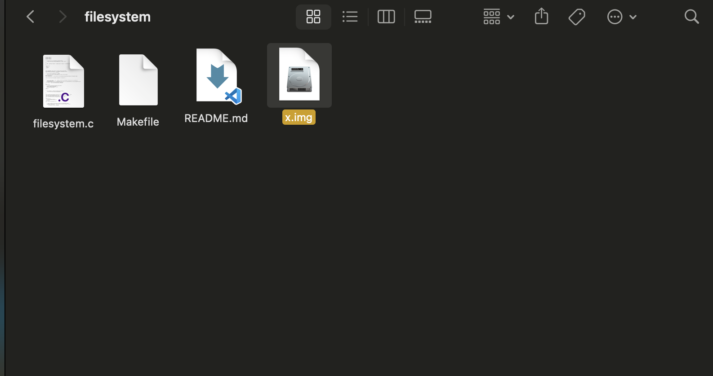

# filesystem

## Custom file system implementation for learning

* ```dd if=/dev/zero of=x.img bs=1M count=10```

- used this command to create a 10 mb disc , you can use any size but remember to change this
```#define NUMBER_OF_SECTOR 20480 // I am assuming i have 10 MB of x.img !```

- after this i will try to make inode dynamic just like zfs and may be try to use main args for ease !

* my fs looks something like this



